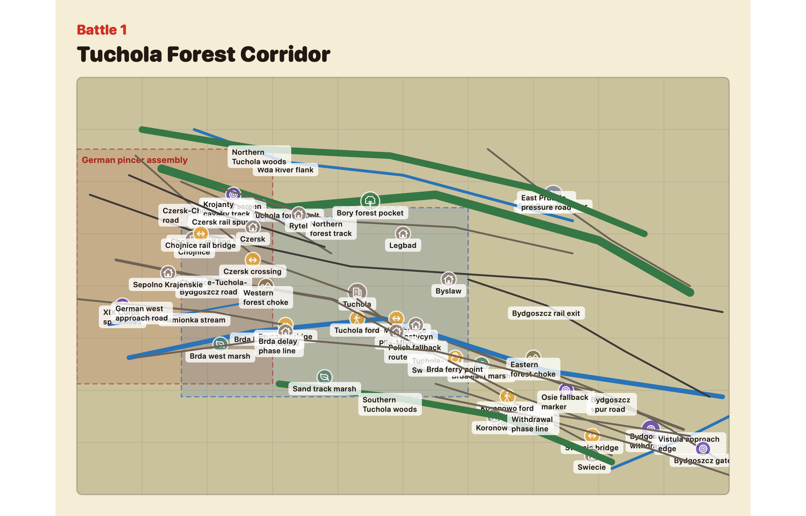
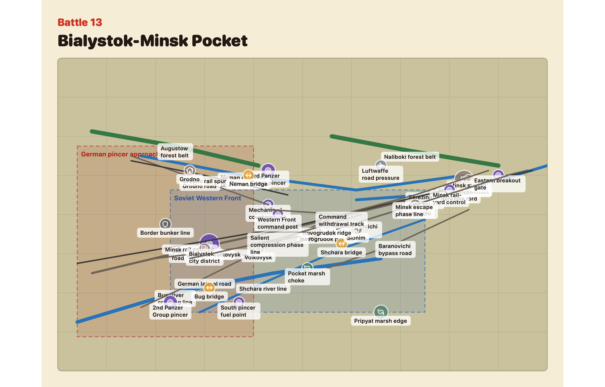

# guderian

`guderian` is a macOS World War II wargame project about battles connected to Heinz Guderian's field commands. Field-command battles expose a playable-side selector: the default lens is the opposing force resisting, delaying, escaping, or counterattacking Guderian's formations, while Guderian's command can also be selected as a sober command-study mode.

The intended stack is a macOS game using SwiftUI, Metal, and a C rules core. The project is based on the included `dzw` (`derZweiteWeltkrieg`) engine, which should be treated as read-only unless a Guderian-specific hook is guarded by:

```c
#define HEINZ_GUDERIAN_GAME
```

That define is enabled only for the Guderian workspace/package path so upstream `dzw` development is not affected.

The local engine boundary currently includes the Guderian scenario board bridge:

- Guarded by `HEINZ_GUDERIAN_GAME`: `DZW_GUDERIAN_LABEL_LENGTH`, the Guderian label buffers stored on `game_t`, and `game_apply_guderian_scenario_board`, which replaces the generic skirmish board with scenario-authored mission text, terrain zones, objectives, and target score.
- The public board-size boundary functions `game_board_width()` and `game_board_height()`, which let Swift UI code read the engine dimensions without duplicating the C constants.

Keep new engine changes outside `dzw` when possible. When a C rules change is unavoidable for Guderian, guard it with `HEINZ_GUDERIAN_GAME`, document the symbol here, and treat it as local to this checkout unless a later upstreaming pass explicitly promotes it.

## Contact And Feedback

Contact `barbalet at gmail dot com` if you have questions, feedback, or would like to collaborate.

Join the [Guderian Discord server](https://discord.gg/FzyszZFS2c) for discussion and coordination.

File bugs, requests, and trackable feedback in [GitHub Issues](https://github.com/barbalet/guderian/issues). GitHub issue tracking requires signing in with a GitHub account or a Google account so you can receive progress updates on the issues you file.

## Screenshots

Initial battle maps show the starting board state with unit counters visible and without tactical overlay lines.





## Included Engine Review

The `dzw` directory is a complete playable World War II skirmish engine and app:

- C rules engine: `dzw/Sources/DerZweiteWeltkriegCore`
- SwiftUI shell: `dzw/Sources/DerZweiteWeltkriegApp`
- Swift tests: `dzw/Tests/DerZweiteWeltkriegTests`
- Existing engine roadmap and rules notes: `dzw/docs/wwii_development_roadmap.md`, `dzw/docs/engine_strategy.md`
- Existing data ledgers: `dzw/docs/wwii_demo_scope.md`, `dzw/docs/wwii_unit_profiles.md`, `dzw/docs/wwii_weapon_taxonomy.md`, `dzw/docs/wwii_armor_profiles.md`, `dzw/docs/wwii_battlefield_profiles.md`

Useful inherited scope from `dzw`:

- Allies/Axis nation selection for British, American, Australian, Soviet, German, and Italian forces.
- Objective missions, turn phases, movement, shooting, morale, pinning, assaults, artillery, transports, mounted fire arcs, vehicle damage, hull-down, smoke, and victory scoring.
- A SwiftUI setup/board/sidebar flow backed by C snapshots, which is a good fit for adding historical scenarios without duplicating rules in the UI.

Guderian-specific work should mostly add campaign data, scenario maps, app identity, opponent AI, and historical presentation around this engine. Engine changes should be rare, guarded, and documented.

The embedded `dzw` package now owns the Bolt Action-style order-dice rules migration. Guderian's consumer-layer adaptation starts with the cycle 1-20 audit, impact map, compatibility shim, and acceptance gates recorded in `docs/guderian_order_dice_cycle_001_020.md`; cycles 21-40 add quality, side-cup, eligibility, and setup-migration contracts in `docs/guderian_order_dice_cycle_021_040.md`; cycles 41-60 add side-ownership binding, the first order panel, order-aware inspection, and movement previews in `docs/guderian_order_dice_cycle_041_060.md`; cycles 61-80 add shooting, vehicle, close-quarters, and Guderian-command AI activation contracts in `docs/guderian_order_dice_cycle_061_080.md`; cycles 81-100 add opposing-force activation AI, standing-order choices, pins/morale risk, and target reactions in `docs/guderian_order_dice_cycle_081_100.md`.

## Historical Scope

Wikipedia was used as the initial open research shelf for [Heinz Guderian](https://en.wikipedia.org/wiki/Heinz_Guderian)'s World War II field-command battles. The playable campaign should prioritize battles where Guderian commanded XIX Army Corps, Panzergruppe Guderian, 2nd Panzer Group, or 2nd Panzer Army. Later staff positions, including Inspector General of Armoured Troops and acting Chief of the Army General Staff, are historical context rather than direct battlefield command scenarios.

The game should avoid celebratory framing. Guderian was a senior Nazi German commander; the default player-facing fantasy is resistance against his offensives. When the player chooses Guderian's command, that side is presented as historical command study and comparison, not admiration or role-play. Historical notes should acknowledge the wider criminal context of the Wehrmacht where relevant.

The chronology below names the primary opposing or alternate force for each battle. Scenario design notes describe the default opposing-force lens unless they explicitly mention command-study play; field-command battles can be launched from either side through the `Playable Side` selector. Automated opposition is authored in both directions: Guderian-command study now faces phase-aware opposing armies with distinct Polish, French, Allied port-defense, Soviet 1941, and Soviet winter behavior, while late-career battles keep their caveated playable-force AI treatment.

## Battle Chronology

| Order | Date | Battle / Operation | Guderian Command | Primary Opposing / Alternate Force | Result | Scenario Design Notes |
| --- | --- | --- | --- | --- | --- | --- |
| 1 | 1-5 Sep 1939 | [Battle of Tuchola Forest](https://en.wikipedia.org/wiki/Battle_of_Tuchola_Forest) | XIX Panzer Corps under 4th Army | Polish Pomeranian Army elements in the Polish Corridor | German victory | First full-campaign expansion scenario. Default opposing-side play blocks Brda crossings, disrupts Chojnice-Tuchola pursuit, uses Krojanty cavalry screening, and withdraws assets toward Bydgoszcz before encirclement. |
| 2 | 7-10 Sep 1939 | [Battle of Wizna](https://en.wikipedia.org/wiki/Battle_of_Wizna) | XIX Panzer Corps; Guderian listed with Ferdinand Schaal | Polish fortified line under Wladyslaw Raginis and Stanislaw Brykalski | German victory | Compact tutorial battle. Default opposing-side play holds bunkers, anti-tank guns, and machine-gun positions against overwhelming German armor and artillery. |
| 3 | 14-17 Sep 1939 | [Battle of Brzesc Litewski](https://en.wikipedia.org/wiki/Battle_of_Brze%C5%9B%C4%87_Litewski) | XIX Panzer Corps, including 10th Panzer, 3rd Panzer, and 20th Infantry Division | Polish Brzesc defense group under Konstanty Plisowski | German victory | Fortress/urban delay. Default opposing-side play uses old FT-17 tanks, armored trains, artillery, and fallback routes to slow mechanized assault. |
| 4 | 14-18 Sep 1939 | [Battle of Kobryn](https://en.wikipedia.org/wiki/Battle_of_Kobry%C5%84) | XIX Panzer Corps, primarily 2nd Motorized Infantry Division | Polish Operational Group Polesie / 60th Reserve Infantry Division under Adam Epler | Inconclusive | Rearguard battle. Default opposing-side play scores by preserving force cohesion, blocking routes, and escaping before encirclement. |
| 5 | 12-17 May 1940 | [Battle of Sedan](https://en.wikipedia.org/wiki/Battle_of_Sedan_%281940%29) | XIX Army Corps under Panzergruppe Kleist | French 2nd Army sector with British air support | German victory | First demo centerpiece. Default opposing-side play defends the Meuse crossing, bridge approaches, artillery positions, and counterattack routes under air pressure. |
| 6 | 15-17 May 1940 | Stonne / Sedan bridgehead flank actions, documented in [Battle of Sedan](https://en.wikipedia.org/wiki/Battle_of_Sedan_%281940%29) and [XIX Army Corps](https://en.wikipedia.org/wiki/XIX_Army_Corps) | XIX Army Corps, especially 10th Panzer and Grossdeutschland | French armor and infantry around Stonne heights | German bridgehead secured | Heavy-tank counterattack scenario. Default opposing-side play uses Char B1 bis shock, village cover, and hill control to threaten the bridgehead. |
| 7 | 17-19 May 1940 | [Battle of Montcornet](https://en.wikipedia.org/wiki/Battle_of_Montcornet) | Guderian listed with Luftwaffe support; German 1st Panzer Division in sector | French 4e Division cuirassee under Charles de Gaulle | French tactical victory / withdrawal after air pressure | Armored counterattack. Default opposing-side play gets strong tanks but limited support and must raid German columns before disengaging. |
| 8 | 20 May 1940 | Channel coast race through Amiens-Abbeville, documented in [XIX Army Corps](https://en.wikipedia.org/wiki/XIX_Army_Corps) | XIX Army Corps | French/British blocking forces on Somme approaches | German breakthrough to Channel | Mobile operational interlude. Default opposing-side play buys evacuation time by holding bridges, towns, and road junctions. |
| 9 | 22-25 May 1940 | [Battle of Boulogne](https://en.wikipedia.org/wiki/Battle_of_Boulogne) | XIX Corps under Guderian; 2nd Panzer Division attack | French, British, Belgian port defenders | German victory | Port defense. Default opposing-side play protects harbor evacuation, Haute Ville, destroyer fire windows, RAF/naval support, and demolition teams while German armor closes in. |
| 10 | 22-26 May 1940 | [Siege of Calais](https://en.wikipedia.org/wiki/Siege_of_Calais_%281940%29) | XIX Corps sector; 10th Panzer Division under Ferdinand Schaal | British, French, Belgian defenders | German victory | High-value delay. Default opposing-side play holds layered defenses, supply points, citadel/docks, and Dunkirk-time scoring rather than expecting to retain the port. |
| 11 | 26 May-4 Jun 1940 | [Battle of Dunkirk](https://en.wikipedia.org/wiki/Battle_of_Dunkirk) | Guderian-adjacent campaign pressure after Channel port drive | British, French, Belgian, Dutch evacuation perimeter | Allied evacuation / German operational success in France | Supplemental scenario with explicit command-scope caveat. Default opposing-side play conducts canal defense, rear-guard sacrifice, beach-capacity management, and evacuation scoring. |
| 12 | 10-22 Jun 1940 | [Fall Rot](https://en.wikipedia.org/wiki/Fall_Rot) / Panzergruppe Guderian drive toward the Swiss border, also documented in [XIX Army Corps](https://en.wikipedia.org/wiki/XIX_Army_Corps) | Panzergruppe Guderian | French defenders around Aisne, Marne-Rhine Canal, Langres, Belfort, and Epinal | German victory | Late-France campaign chain. Default opposing-side play stages bridge demolitions, fortress-town stands, fuel/congestion denial, and Vosges retreat-corridor preservation. |
| 13 | 22 Jun-9 Jul 1941 | [Battle of Bialystok-Minsk](https://en.wikipedia.org/wiki/Battle_of_Bia%C5%82ystok%E2%80%93Minsk) | 2nd Panzer Group as Army Group Centre's southern pincer | Soviet Western Front formations | German victory | Encirclement survival. Default opposing-side play fights breakout lanes, mechanized counterattack delays, Minsk road/rail preservation, command evacuation, and pocket attrition. |
| 14 | 10 Jul-10 Sep 1941 | [Battle of Smolensk](https://en.wikipedia.org/wiki/Battle_of_Smolensk_%281941%29) | 2nd Panzer Group with Hoth's northern pincer | Soviet 16th, 19th, 20th, and reserve armies around Smolensk | German victory, but German advance slowed | Major Eastern Front module. Default opposing-side play holds Dnieper/Dvina crossings, counterattacks pincer shoulders, forces German logistics strain, and opens Yartsevo escape lanes from the pocket. |
| 15 | 30 Aug-12 Sep 1941 | [Roslavl-Novozybkov offensive](https://en.wikipedia.org/wiki/Roslavl%E2%80%93Novozybkov_offensive) | 2nd Panzer Group turned south toward Kiev with German 2nd Army support | Soviet Bryansk Front under Andrey Yeryomenko | German victory | Soviet spoiling offensive. Default opposing-side play reveals German intent, raids supply columns, damages southward-turn tempo, and withdraws tank groups before counterpressure closes lanes. |
| 16 | 7 Jul-26 Sep 1941 | [Battle of Kiev](https://en.wikipedia.org/wiki/Battle_of_Kiev_%281941%29) | 2nd Panzer Group northern pincer with Kleist's 1st Panzer Group | Soviet Southwestern Front | German victory and major encirclement | Large pocket campaign. Default opposing-side play delays northern pincer closure, keeps eastern corridors contested, evacuates command assets, and stages breakout operations before pocket reduction. |
| 17 | 30 Sep-21 Oct 1941 | [Battle of Bryansk](https://en.wikipedia.org/wiki/Battle_of_Bryansk_%281941%29) | 2nd Panzer Group / 2nd Panzer Army during Operation Typhoon | Soviet Bryansk Front, including 50th, 13th, and 3rd Armies | German victory | Operation Typhoon southern approach. Default opposing-side play keeps pocketed armies active, preserves Bryansk rail command, protects the Orel-Tula road, and forces autumn logistics checks. |
| 18 | 4-11 Oct 1941 | Mtsensk fighting, supported by [Mikhail Katukov](https://en.wikipedia.org/wiki/Mikhail_Katukov), [German T-34/KV encounter](https://en.wikipedia.org/wiki/German_encounter_of_Soviet_T-34_and_KV_tanks), [4th Panzer Division](https://en.wikipedia.org/wiki/4th_Panzer_Division), [1st Guards Special Rifle Corps](https://en.wikipedia.org/wiki/1st_Guards_Special_Rifle_Corps), and [Battle of Moscow](https://en.wikipedia.org/wiki/Battle_of_Moscow) context | Guderian's Panzergruppe 2 sector, including 4th Panzer Division pressure | Soviet 4th Tank Brigade, 1st Guards Rifle Corps, and supporting anti-tank/artillery detachments | Soviet delaying success | Playable armored showcase. Default opposing-side play uses Katukov-style T-34/KV ambushes, anti-tank screens, wooded ridge cover, and staged withdrawals to blunt the Orel-Mtsensk-Tula road advance. |
| 19 | 2 Oct 1941-7 Jan 1942 | [Battle of Moscow](https://en.wikipedia.org/wiki/Battle_of_Moscow), focused on the Orel-Mtsensk-Tula-Venev-Kashira southern pincer and [2nd Panzer Army](https://en.wikipedia.org/wiki/2nd_Panzer_Army) | 2nd Panzer Army under Guderian | Soviet forces defending Tula, Kashira, Mordves, and southern approaches to Moscow | Soviet victory | Expanded final demo/full-campaign climax. Default opposing-side play balances winter roads, Tula city defense, Venev/Kashira bypass denial, mobile reserves, German exhaustion, and counteroffensive timing. |
| 20 | 5-16 Jul 1943 | [Battle of Kursk](https://en.wikipedia.org/wiki/Battle_of_Kursk) / Kursk Armored Force Pressure | Inspector General influence; not a Guderian field command | Soviet mine, anti-tank, artillery, and armored reserve defenders | Soviet victory and German offensive failure | Unified late-career battle. The playable force holds deep defenses, anti-tank zones, reserve lanes, and armored counterpressure while the historical caveat stays a briefing/source label only. |
| 21 | 24 Aug-23 Dec 1943 | [Battle of the Dnieper](https://en.wikipedia.org/wiki/Battle_of_the_Dnieper) / Dnieper Withdrawal and Bridgeheads | Inspector General influence; not a Guderian field command | Soviet Front detachments forcing crossings and isolating German bridgeheads | Soviet victory | River-crossing and bridgehead battle. The playable force forces Dnieper crossings, expands lodgments, blocks withdrawal roads, and contests German bridgehead escape routes. |
| 22 | 24 Jan-16 Feb 1944 | [Korsun-Cherkassy Pocket](https://en.wikipedia.org/wiki/Korsun%E2%80%93Cherkassy_pocket) | Inspector General influence; not a Guderian field command | Soviet blocking, armored, and cavalry-mechanized groups sealing breakout roads | Soviet operational success; German breakout with heavy losses | Winter pocket battle. The playable force seals crossings, uses thaw/snow movement lanes, blocks Shenderovka roads, and scores by preventing coherent breakout. |
| 23 | 4 Mar-15 Apr 1944 | [Kamenets-Podolsky Pocket](https://en.wikipedia.org/wiki/Kamenets-Podolsky_pocket) | Inspector General influence; not a Guderian field command | Soviet mobile groups trying to close river exits and road junctions | German breakout from encirclement after Soviet advance | Mud-season escape-corridor battle. The playable force closes Dniester and Southern Bug approaches, blocks Tarnopol roads, and pressures pocket exits before German formations escape. |
| 24 | 22 Jun-19 Aug 1944 | [Operation Bagration](https://en.wikipedia.org/wiki/Operation_Bagration) / Operation Bagration Withdrawal Crisis | Army General Staff influence; not a Guderian field command | Soviet Front spearheads destroying Army Group Centre withdrawal routes | Decisive Soviet victory | Collapse-and-pursuit battle. The playable force overruns rail corridors, Berezina crossings, Minsk roads, and Pripet flank exits while German command tries to preserve a line. |
| 25 | 13 Jul-29 Aug 1944 | [Lvov-Sandomierz Offensive](https://en.wikipedia.org/wiki/Lvov%E2%80%93Sandomierz_Offensive) / Lvov-Sandomierz Breakthrough | Army General Staff influence; not a Guderian field command | Soviet attackers forcing bridgeheads and operational pursuit lanes | Soviet victory | Breakthrough and bridgehead battle. The playable force opens the Lvov road net, forces Vistula crossings, grows the Sandomierz bridgehead, and protects pursuit tempo. |
| 26 | 1 Aug 1944-11 Jan 1945 | [Vistula-Oder Offensive](https://en.wikipedia.org/wiki/Vistula%E2%80%93Oder_Offensive) context / Narew and Vistula Bridgeheads | Army General Staff influence; not a Guderian field command | Soviet bridgehead defenders expanding lodgments before the winter offensive | Soviet bridgeheads held for the January offensive | Bridgehead-expansion battle. The playable force holds Magnuszew, Pulawy, and Narew lodgments, widens crossing zones, and sets launch positions for the winter offensive. |
| 27 | 1 Aug 1944-17 Jan 1945 | [Warsaw Uprising](https://en.wikipedia.org/wiki/Warsaw_Uprising) and [Vistula-Oder Offensive](https://en.wikipedia.org/wiki/Vistula%E2%80%93Oder_Offensive) context / Warsaw-Area Defensive Arcs | Army General Staff influence; not a Guderian field command | Soviet and Polish-aligned forces pressuring Warsaw approaches, Vistula crossings, and German defensive belts | German suppression of the uprising followed by Soviet capture of Warsaw in January 1945 | Urban-approach battle. The playable force pressures Modlin, Praga, Vistula crossings, road and rail belts, and Warsaw-area defensive arcs with sober caveat framing. |
| 28 | 12 Jan-2 Feb 1945 | [Vistula-Oder Offensive](https://en.wikipedia.org/wiki/Vistula%E2%80%93Oder_Offensive) / Vistula-Oder Breakthrough | Army General Staff influence; not a Guderian field command | Soviet breakthrough and pursuit forces racing from Vistula bridgeheads toward the Oder | Decisive Soviet victory | Operational pursuit battle. The playable force breaks from Vistula bridgeheads, races through Lodz and Warta crossings, protects spearhead tempo, and reaches Oder approaches. |
| 29 | 24 Jan-23 Feb 1945 | [Battle of Poznan (1945)](https://en.wikipedia.org/wiki/Battle_of_Pozna%C5%84_(1945)) / Poznan Corridor and Encirclement | Army General Staff influence; not a Guderian field command | Soviet assault and bypass groups isolating fortress-city defenses | Soviet victory | Fortress-bypass battle. The playable force isolates Poznan, contests Warta crossings, opens Berlin road corridors, and decides when to bypass or reduce fortified districts. |
| 30 | 13 Jan-25 Apr 1945 | [East Prussian Offensive](https://en.wikipedia.org/wiki/East_Prussian_Offensive) / East Prussia and Elbing Cutoff | Army General Staff influence; not a Guderian field command | Soviet forces cutting coastal roads, lagoon exits, and fortress pockets | Soviet victory | Northern-collapse battle. The playable force cuts Elbing and Vistula Lagoon routes, isolates coastal pockets, and controls road, rail, and evacuation geography. |
| 31 | 15-18 Feb 1945 | [Operation Solstice](https://en.wikipedia.org/wiki/Operation_Solstice) at Stargard, with [Army Group Vistula](https://en.wikipedia.org/wiki/Army_Group_Vistula) context / Operation Solstice at Stargard | Army General Staff influence; not a Guderian field command | Soviet defenders and counterattack groups containing German relief attacks | German counteroffensive failed | Counterstroke-containment battle. The playable force holds Stargard-Arnswalde routes, absorbs relief pressure, protects the Oder flank, and turns failed German attacks into tempo loss. |
| 32 | 24 Feb-4 Apr 1945 | [East Pomeranian Offensive](https://en.wikipedia.org/wiki/East_Pomeranian_Offensive) | Army General Staff influence; not a Guderian field command | Soviet and Polish forces clearing the Baltic flank before Berlin | Soviet and Polish victory | Baltic-flank battle. The playable force clears Pomeranian lakes, Kolberg coast, Danzig approaches, and Oder flank lanes before the Berlin operation. |
| 33 | 1 Feb-30 Mar 1945 | [Battle of Kustrin](https://en.wikipedia.org/wiki/Battle_of_K%C3%BCstrin) / Kustrin and Oder Bridgeheads | Army General Staff influence; not a Guderian field command | Soviet bridgehead forces expanding west-bank positions toward Berlin | Soviet victory and bridgehead expansion | Oder-bridgehead battle. The playable force expands west-bank positions, contests Kustrin fortress exits, secures Reitwein spur, and prepares Seelow approaches. |
| 34 | 16-19 Apr 1945 | [Battle of the Seelow Heights](https://en.wikipedia.org/wiki/Battle_of_the_Seelow_Heights) / Seelow Heights Epilogue | Post-dismissal context; not a Guderian field command | Soviet assault armies breaking the Oder-Seelow defensive belt | Soviet victory | Final-approach epilogue. The playable force breaks the Oderbruch and Seelow defensive belt with the same playable UI while the post-dismissal caveat remains historical framing only. |
| 35 | 20 Apr-2 May 1945 | [Battle of Berlin](https://en.wikipedia.org/wiki/Battle_of_Berlin) and [Battle of Halbe](https://en.wikipedia.org/wiki/Battle_of_Halbe) / Berlin and Halbe Epilogue | Post-dismissal context; not a Guderian field command | Soviet, Polish, and Allied-aligned forces reducing final pockets and escape attempts | Soviet victory and final German defeat in Berlin | Closing epilogue battle. The playable force fights through urban districts, Spree crossings, Teltow Canal, and Halbe forest escape roads without changing the unified battle UI tier. |

## Development Plan

The detailed development plan, cycle history, current ship status, and remaining-cycle estimates are tracked in [PLAN.md](PLAN.md).

## Run

Build and test from the repository root:

```bash
swift test
swift build
```

Run the initial Guderian scenario workspace:

```bash
swift run GuderianApp
```

Or open `Guderian.xcodeproj` in Xcode and run the shared `Guderian` macOS scheme.

## App Identity

The app icon uses a face-focused crop of the public-domain Wikimedia Commons portrait documented in `Resources/AppIconSource/README.md`. The crop is intentionally limited to historical subject identification.
